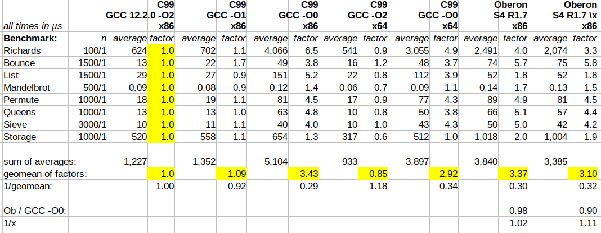
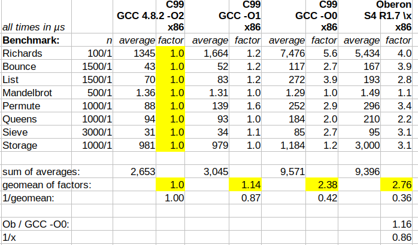
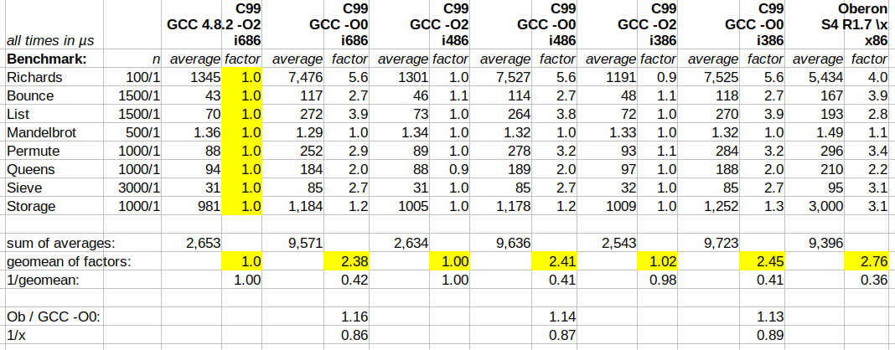

### Motivation

In his 2000 publication [Compiler Construction - The Art of Niklaus Wirth](https://ssw.jku.at/Research/Papers/Moe00b.html) (Chapter in: Böszörmeny et al.(eds): The School of Niklaus Wirth, dpunkt.verlag 2000, pp.55-68), Mössenböck claims that:

> Brandis and others report that non-optimizing Oberon compilers for the Motorola 68020, for the Sun
> SPARC and for the DEC MIPS architectures generated code that was as
> efficient as the code generated by the standard C compiler with the
> optimization option switched on (cc -O). Only for the IBM RS/6000 the
> optimizing C compiler was able to generate more efficient code than the
> Oberon compiler.

He refers to Brandis M., Crelier R., Franz M., Templ J.: The Oberon System Family. Software—Practice and Experience 25(12): 1331-1366, 1995, for this claim. This publication, which seems to be identical with the [1992 ETH Report Nr. 174](https://www.research-collection.ethz.ch/handle/20.500.11850/68908), compared the performance of the Dhrystone benchmark compiled with the OP2 compiler re-targeted to different platforms with the C version of the benchmark compiled with the standard C compiler of the target (see Table 14 on page 25). On MIPS and RS/6000, the Oberon executable seems to be a bit faster than the unoptimized C executable (~30% for MIPS, ~15% for RS/6000). On MC68020 they are on par (while, surprisingly, the optimized C version seems to be slower than the unoptimized). And on SPARC, the Oberon executable seems indeed to be on par with the optimized C executable (twice as fast as the unoptimized C executable). 

This raises the crucial question, whether these results really demonstrate that the claim by Mössenböck is true, or rather that OP2 can be expected to enable similar performance to unoptimized C compilers (which is the case on three platforms), and that the SPARC C compiler likely had some kind of problem. There is evidence that the Sun compiler had [known performance issues](https://web.archive.org/web/20240424052158/http://impact.crhc.illinois.edu/shared/report/ms-thesis-roland-ouellette.pdf). 

But what was actually measured? Dhrystone is a synthetic computing benchmark program. It was designed to be representative of system (integer) programming and has become a standard measure of general processor performance. Using Dhrystone to benchmark compiler-generated code is problematic for several fundamental reasons; its 52 assignments, 33 control statements, don't reflect modern programming idioms, lack realistic data structure complexity, contain no floating-point operations, and have only trivial memory access patterns. For serious compiler benchmarking, modern approaches like [Stefan Marr's Are-we-fast-yet](https://stefan-marr.de/downloads/dls16-marr-et-al-cross-language-compiler-benchmarking-are-we-fast-yet.pdf) are more appropriate. 

The present repository includes versions of the Are-we-fast-yet suite ported to C and other languages, including an Oberon 90 version. The latter is not yet complete. All microbenchmarks were migrated; of the macrobenchmarks, only Richards has been migrated so far. However, what is already available is suitable for a first representative overview. An x86 backend for the OP2 compiler was implemented by N. Mannhart in 1993; this implementation was used for the native and Linux based Oberon System 3 and 4 versions compatible with the PC platform. There are still running versions available today which can be used to run the benchmark. 

### Measurement Setup

For the present measurement, a pre-compiled [release 1.7.02 of Oberon System V4](https://sourceforge.net/projects/oberon/files/Oberon%20V4%20for%20GNU_Linux/) was used, based on [this recommendation](https://lists.inf.ethz.ch/pipermail/oberon/2025/017061.html). It includes the OP2 version by Mannhart with changes up to 1997.

Two different machines were used to run the benchmarks: a 2018 Lenovo Thinkpad T480 running Debian Bookworm (x64 version with i386 subsystem, kernel version 6.1, GCC version 12.2.0), and a 2009 HP EliteBook 2530p running an i386 Linux Mint Rebecca (kernel version 3.13, GCC version 4.8.2). 

A micro-second Time() function was implemented in Harness.Mod using Unix.Gettimeofday. All modules can be successfully compiled. All benchmarks besides NBody and Towers work (the latter crash for yet unknown reasons, work in progress).

The Oberon versions were compiled from within the Oberon System, using the command `Compiler.Compile Name.Mod` to compile with default options, and `Compiler.Compile Name.Mod\x` to compile with default options minus index checking (to reduce runtime overhead). `Name.Mod` is a placeholder for all modules of the benchmark suite. The options enabled by default are `x` (index check on), `t` (type check on), `p` (pointer init) and `a` (asserts evaluated). There are no ASSERTs in the benchmark code, so the `a` option has no effect.

The C versions were compiled with a command like this `gcc -O2 *.c som/*.c -lm -m32` directly in the `C` subdirectory of the repository, using standard GCC version available in the corresponding Linux distribution; note that `-m32` enables an x86 build on the x64 system; when left out, an x64 binary is compiled.

### Results

The following table lists all benchmarks run on the Thinkpad T480, with `n` being the number of runs, and for each language/compiler/option/architecture tuple the `average` runtime in microseconds is noted and a `factor` which relates this average with the reference (C99/GCC/-O2/x86). For each tuple, the geometric mean of the factors is calculated for comparison.

For the Oberon benchmarks, in addition to the comparison with the reference, also the comparison with the unoptimized C version (-O0 option) is noted. As can be seen, both Oberon 
compilation variants are slightly (~2% and ~10%) faster than the unoptimized GCC version, but also significantly slower than the optimized GCC versions. It can be seen that Oberon 
index checking costs ~8% performance. For a fair comparison with C it makes sense to switch off all such checks.

It's interesting to note that the -O1 optimization is much closer to -O2 than to -O0, so the minimal set of optimizations seem to have the maximum effect. It's also interesting to see that the performance gain when going from x86 to x64 gain is smaller than often claimed (only ~18%).

The following table lists the benchmark runs on the EliteBook 2530p, with the labels having the same meaning as described above. It's an x86 only machine, and only the \x version 
of Oberon was run. Comparing with the T480 results show that there is a speed-up of factor 2 to 3 when going from the 2009 to 2018 processor generation. It can also be seen, that
the optimization capability of the GCC compiler apparently increased by factor 1.4 over ~10 years. Given these two data points and assuming linear growth, the speed-up factor
of compilers in 1992 from unoptimized to optimized code was around 1.6 (when Are-we-fast-yet would have been used instead of Dhrystone). 

Another interesting observation is that unoptimized GCC 4.8 seems to generate faster code than unoptimized GCC 12.2; accordingly, the Oberon compiler generates code which is
~14% slower than unoptimized GCC. So it would be wrong to claim that OP2 is generally a bit faster than unoptimized GCC.

### Discussion

The results show that the aforementioned claim very likely doesn't hold. The Oberon compiler apparently generates good code (which runs faster than the unoptimized code of 
some GCC versions), but the performance is obviously far away from what an optimizer can do. 
The present results indicate that the SPARC result reported by Brandis et al. was likely due to errors in the Sun compiler. 
This also refutes claims like "Wirth's compilers achieved 80% of the performance of optimizing compilers with 20% of the complexity", which can be found in 
times on social media. 

### Update July 25

This section addresses [the concern](https://lists.inf.ethz.ch/pipermail/oberon/2025/017064.html) that the more modern GCC versions used 
for the present measurement would emit instructions which were not available at the time or not used by the OP2 version in question (thus possibly preventing a fair comparison).

When Mössenböck made his claim (see above), the Oberon Systems 3 and 4 were still in development. Since the Pentium Pro appeared in 1995, so the i686 instruction set, to which both 
GCC versions defaulted, seemed appropriate. 

In 1993, when the implementation of the OP2 x86 backend started, the Pentium (i586 instruction set) was launched, and the i486 instruction set was already on the market
for four years (introduced in 1989). The i386 instruction set dates back to 1985, before the first Oberon System even existed. 

Unfortunately, a "period-correct" GCC version from 1993 (i.e. GCC 2.4.x) is not available, but we can limit what instruction set GCC is using with the `-march` option. 

The following table is an extension of the EliteBook 2530p table above. The C99/-O2/i686, C99/-O0/i686 and Oberon columns were copied from the mentioned table. The i486 and i386
average/factor columns show the results of the benchmarks compiled with the `-march=i486` and `-march=i386` GCC options, which limit the instruction set emitted by GCC. It can
be seen that **the difference between the runs with different instruction sets is very small and doesn’t alter the overall conclusion**.

